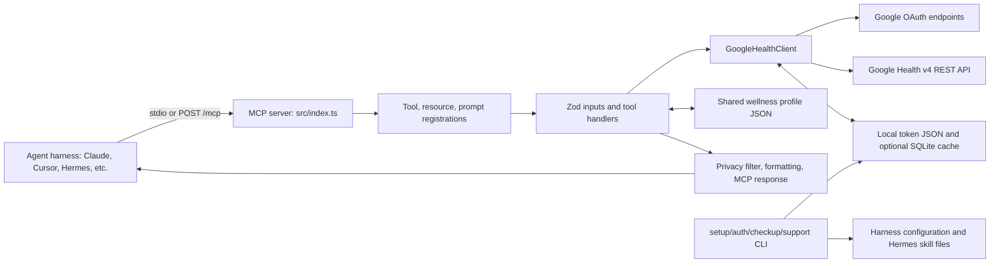

# Google Health Fitbit MCP: codebase and security review

Reviewed locally on 2026-09-25. This is an **unofficial** TypeScript/Node MCP connector (package version 1.0.3), not a Google or Fitbit component. This document describes the checked-out source, not a verified npm tarball, dependency tree, Google API contract, or live account. No credentials, OAuth flow, or Google Health endpoint were exercised during this review. “Potentially malicious” below means a capability that could be abused or conceal unwanted behavior; it does not assert the author's intent. I found no explicit hard-coded third-party health-data upload endpoint in the application source.

## Revocation remediation

`google_health_revoke_access` and its client revocation/token-deletion implementation have been removed. MCP callers cannot invoke this operation through either transport; there is no alias or opt-in switch. Grant revocation and local credential deletion must happen outside MCP. Authorization URL generation, code exchange, automatic reauthorization, and token refresh remain available. Code exchange retains the separate risk described below. Restart the rebuilt server and refresh the harness tool catalog after upgrading. The original review line references below may have shifted after this change.

## What runs

**HTTP authentication remediation (2026-09-25):** HTTP startup now requires `GOOGLE_HEALTH_MCP_AUTH_TOKEN` (at least 43 base64url characters; generate 32 random bytes). Every MCP request is checked for a matching bearer credential before JSON parsing or MCP server creation. Invalid credentials return 401; disallowed browser origins return 403. Health metadata and CORS preflights remain public. This is a single-owner credential granting the entire MCP surface, so remote deployments still need HTTPS and backend network isolation. Stdio remains unchanged. See `src/services/http-auth.ts`, `src/index.ts`, and `scripts/auth-boundary-test.mjs`.

`package.json` declares Node >=20, ES modules, `tsc` build output at `dist/index.js`, and two binary names. `src/index.ts:14-22` creates an MCP server and registers tools, resources, and prompts. A normal launch uses MCP over **stdio** (`src/index.ts:25-29`); `--http` or `GOOGLE_HEALTH_MCP_TRANSPORT=http` selects an Express Streamable HTTP server (`src/index.ts:31-70,83-92`). The HTTP server exposes `GET /health` and `POST /mcp`; it creates a fresh, stateless MCP server and transport for each POST. The default listener is `127.0.0.1:3000`; environment variables can change the host, port, and allowed browser origin. The default route to Google is `https://health.googleapis.com` (`src/constants.ts:6`), and OAuth authorization and token exchange use Google domains (`src/constants.ts`).

The local `main.py`, `pyproject.toml`, `uv.lock`, `.python-version`, and `.venv/` were untracked at review time. `main.py` only prints a hello message and is **not** the MCP entry point. They were not modified or treated as part of the published Node package.

## System design

| Layer | Responsibility and source |
| --- | --- |
| Transport and CLI dispatch | `src/index.ts`, `src/cli/commands.ts`; stdio by default, optional HTTP and commands such as `setup`, `auth`, `checkup`, `coverage`, `support`, `onboarding`. |
| MCP surface | `src/tools/google-health-tools.ts` registers 28 tools; `src/resources/google-health-resources.ts` registers seven resources; `src/prompts/google-health-prompts.ts` registers three workflow prompts. `src/schemas/common.ts` defines Zod contracts. |
| Google API adapter | `src/services/google-health-client.ts` owns URL construction, bearer auth, token refresh, v4 reads, retry, and cache calls. It has a **non-exposed** experimental nutrition-create method; there is no registered nutrition-write tool (`src/tools/google-health-tools.ts:707-711`). |
| Data shaping | `src/services/privacy.ts` handles `summary`, `structured`, `raw`; `src/services/format.ts` builds text plus `structuredContent`; `src/services/summary.ts` and `src/services/context.ts` combine multiple reads into summaries and wellness context. |
| Local state | `src/services/local-config.ts`, `token-store.ts`, `cache.ts`, `http-cache.ts`, and `profile-store.ts` manage files and memory. `connection-status.ts`, `support-report.ts`, and `coverage-report.ts` inspect/report setup and API coverage. |

## Data and control flow

1. **Harness installation/configuration.** `setup` saves OAuth client ID, client secret, redirect URI, scopes, privacy setting, and optional paths to `~/.google-health-mcp/config.json` with intended `0600` file mode (`src/cli/setup.ts:33-65`, `src/services/local-config.ts:56-70`). It edits supported harness MCP configs; generic, Claude, Cursor, and Windsurf configs use `npx -y google-health-fitbit-mcp`, while Hermes gets a version-pinned package reference and a generated skill (`src/cli/setup.ts:185-281`). Environment values override local JSON (`src/services/config.ts:17-35`).
2. **Authorization.** CLI `auth` launches a loopback callback listener, opens the system browser, validates an OAuth `state`, exchanges the returned code at Google's token endpoint, and stores access/refresh tokens at `~/.google-health-mcp/tokens.json` by default (`src/cli/auth.ts`, `src/services/oauth-loopback.ts`, `src/services/google-health-client.ts:57-84`). The MCP `google_health_get_auth_url` and `google_health_exchange_code` tools support a manual flow. Token writes use a temporary file, rename, a lock, and intended `0600` mode (`src/services/token-store.ts:13-68`).
3. **Read.** A tool input is validated with Zod, obtains the effective config, and calls `GoogleHealthClient`. The client sends a bearer token to v4 endpoints under the configured API base (`src/services/google-health-client.ts:88-154,209-247`). It refreshes near expiry or on a 401. If a refresh grant has expired, local stdio can start interactive reauthorization (`src/services/google-health-client.ts:250-323`, `src/services/interactive-auth.ts`). GET responses pass through a 60-second process-wide memory cache; optional SQLite stores successful GET payloads and may return them after a later request error (`src/services/http-cache.ts`, `src/services/google-health-client.ts:375-401`). Retry handles 408/429/5xx and network errors (`src/services/http-retry.ts`).
4. **Return.** Endpoint tools apply the requested `privacy_mode` and return Markdown or JSON text plus structured MCP content (`src/tools/google-health-tools.ts:76-93`, `src/services/privacy.ts`, `src/services/format.ts`). The default mode is `structured`, not an aggregate-only mode (`src/services/config.ts:55-58`). Resources expose static inventory/capabilities/manifest plus authenticated profile, steps, daily, and weekly views (`src/resources/google-health-resources.ts`).
5. **Derived data.** Daily summaries request eight activity/sleep/heart/body streams per day; weekly summaries limit concurrent day bundles to four (`src/services/summary.ts:5-89`). Wellness context derives sleep hours and training-load labels from the daily summary (`src/services/context.ts`). These are connector heuristics and not clinical interpretation.
6. **Local profile.** Separate from Google's profile, `google_health_profile_get`, `google_health_profile_update`, and onboarding use `~/.delx-wellness/profile.json`, shared with other Wellness connectors. Reads may migrate a legacy profile into that path; updates persist a patch (`src/tools/google-health-tools.ts:591-704`, `src/services/profile-store.ts:1-25,249-274,360-376`).

### Exposed operations

| Group | Tools / behavior |
| --- | --- |
| Static and setup | `data_inventory`, `list_data_types`, `data_type_coverage` (plan or live), `agent_manifest`, `capabilities`, `quickstart`, `demo`, `connection_status`, `cache_status`, `privacy_audit` (all prefixed `google_health_`). |
| OAuth and account mutation | `google_health_get_auth_url`, `google_health_exchange_code`. Exchange writes local tokens. Revocation and credential deletion are not exposed through MCP. |
| Google reads | `get_identity`, `get_profile`, `get_settings`, `list_paired_devices`, `get_irn_profile`, `get_data_point`, `list_data_points`, `reconcile_data_points`, `daily_rollup`, `rollup` (all prefixed `google_health_`). Rollups use POST requests for read/aggregation semantics. |
| Derived/local | `google_health_daily_summary`, `google_health_weekly_summary`, `google_health_wellness_context`, `google_health_profile_get`, `google_health_profile_update`, `google_health_onboarding`. |

The catalog in `src/constants.ts:50-93` is guidance, not an enforced allowlist: `GoogleHealthDataTypeSchema` accepts other kebab-case slugs (`src/schemas/common.ts:14-20`). Default scopes cover profile, settings, activity, measurements, sleep, and nutrition reads; ECG/IRN and nutrition-write are optional (`src/constants.ts:11-34`). There is **no direct Fitbit Web API call** in this source: Fitbit/Pixel Watch data is expected through the Google Health account and v4 API. Whether those data sources and specific endpoints are available depends on the real Google account and API, which this review did not verify.

## Security and potentially malicious behavior to review before connecting a harness

Severity describes the consequence if the behavior is exposed or abused; it is not a claim of demonstrated exploitation.

| Severity | Finding and evidence | Consequence / mitigation |
| --- | --- | --- |
| **Critical if network-exposed — remediated in source** | Originally, HTTP `POST /mcp` had no application authentication. HTTP now refuses startup without a configured bearer secret and authenticates all MCP methods before parsing or dispatch (`src/services/http-auth.ts`, `src/index.ts`). | Unauthenticated callers cannot invoke tools or read resources. Credential holders have full account access; use a randomly generated secret, HTTPS, and backend network isolation for remote deployments. Rebuild and restart, and configure clients with the new Authorization header. |
| **High** | `google_health_exchange_code` has a description-only user-intent gate; its handler can replace stored credentials without enforced confirmation. MCP annotations are hints, not enforcement. | Credential replacement remains a risk. Restrict code exchange at the harness boundary or implement a real user-confirmation gate. The caller-supplied profile update boolean also cannot prove human consent. |
| **High** | `GOOGLE_HEALTH_API_BASE_URL` can come from environment or local config without origin validation (`src/services/config.ts:26-35`); the client attaches `Authorization: Bearer ...` to requests built from that base (`src/services/google-health-client.ts:209-237,347-355`). | A poisoned config or environment can direct bearer tokens and health requests to another host. Fix the API origin to the expected HTTPS Google host in trusted deployments; audit local config before launch. The OAuth token endpoint constant itself is a fixed Google URL. |
| **High** | The optional SQLite cache stores **unfiltered API JSON** in plaintext and keys it only by method+URL (`src/services/google-health-client.ts:375-394`, `src/services/cache.ts:22-65`). There is no user/account key, expiry, encryption, or explicit database file mode. It may serve stale data after a failed fetch. | Health records can persist after external grant revocation and, if accounts switch while sharing a cache path, old-account data can be returned for the same URL. Disable SQLite unless necessary; isolate/cache-protect per account, clear it on disconnect, and apply retention. The 60-second in-memory cache is also keyed only by method+URL (`src/services/http-cache.ts:30-78,98-109`). |
| **Medium** | Endpoint tools allow `privacy_mode=raw`, and `structured` retains most health fields after a short exact-key denylist (`src/schemas/common.ts:6-9`, `src/services/privacy.ts:13-37,130-143`). `makeResponse` redacts credentials, not arbitrary measurements or identifiers (`src/services/format.ts:4-11`). Resource handlers independently serialize data and do not use that final formatter (`src/resources/google-health-resources.ts:13-39`). | An agent/harness can receive sensitive health data, and logging or remote model processing is outside this server's control. Use minimal scopes and aggregate mode where practical; treat all MCP responses/resources and harness logs as sensitive. The privacy modes are data shaping, not a confidentiality boundary. |
| **Medium** | Manual OAuth URL generation accepts caller-chosen scopes and optional state; manual code exchange does not validate state or tie the code to a server-side pending authorization (`src/schemas/common.ts:65-78`, `src/tools/google-health-tools.ts:274-309`, `src/services/google-health-client.ts:57-84`). Auto loopback validates state but generates only four random bytes (`src/services/interactive-auth.ts:111-124`, `src/services/oauth-loopback.ts:37-59`). | OAuth account mix-up or consent confusion is possible if an untrusted agent drives the flow. Keep authorization a human-initiated local operation; require server-generated, longer state for every OAuth path and verify it at exchange. |
| **Medium** | `setup` writes/merges harness configuration and installs a Hermes skill (`src/cli/setup.ts:185-281`). For Hermes it adds `approvals.mcp_reload_confirm: false` (`src/cli/setup.ts:305-315`), reducing a reload confirmation. Generic config uses unpinned `npx -y google-health-fitbit-mcp` (`src/cli/setup.ts:227-238`, `smithery.yaml`); Hermes is pinned to the package version. Malformed JSON in existing MCP config is caught and replaced with an empty object before write (`src/cli/setup.ts:199-223`). | Review generated harness changes before running setup. A future npm package version may run different code; use a vetted version or local build. Back up client config, especially if it might be malformed. Do not disable reload confirmation without deciding that policy deliberately. |
| **Medium** | Reading the local wellness profile can auto-copy a legacy profile into `~/.delx-wellness/profile.json` (`src/services/profile-store.ts:261-274,360-376`); `profile_update` writes shared cross-connector context (`src/tools/google-health-tools.ts:621-667`). | “Read-only” onboarding/profile access can cause a local migration write, and profile updates affect other connectors. Inspect the shared profile and restrict the update tool in harness policy if undesired. |
| **Low / operational** | Retry logging writes raw network error messages to stderr (`src/services/http-retry.ts:95-116`), whereas API response errors get targeted token-string redaction (`src/services/google-health-client.ts:362-370`). `src/services/redaction.ts` matches a limited set of credential spellings. | Treat stderr and support output as sensitive and review before sharing. The redaction code is defense in depth, not a complete secret or personal-data scrubber. |

The declared direct dependencies are MCP SDK, Express, CORS, Zod, and `better-sqlite3` (`package.json:76-88`). The package scripts shown here have no root `postinstall` hook (`package.json:17-38`), but installing dependencies or running `npx -y` executes third-party packages outside this source review. The test scripts were not used as a trust proof. The write-gate, nutrition normalizer, and `createNutritionDataPoint()` are present, but no MCP nutrition-write tool is registered; do not mistake those preparatory modules for an active remote write feature (`src/services/remote-write-gate.ts`, `src/services/google-health-client.ts:157-164`, `src/tools/google-health-tools.ts:707-711`).

## Recommended harness boundary

For a first trial, run the reviewed local build over stdio under a dedicated local user, with the smallest OAuth scopes needed. Inspect `~/.google-health-mcp/config.json` and the generated harness command before entering credentials. Allowlist read tools and omit `exchange_code` and `profile_update` until their caller and confirmation policies are settled. Do not enable HTTP on a network interface without authentication. Keep SQLite disabled unless its persistence is required; protect or remove old cache files when changing accounts. These steps reduce exposure but do not independently verify the repository, npm artifact, dependencies, or Google's live API behavior.
